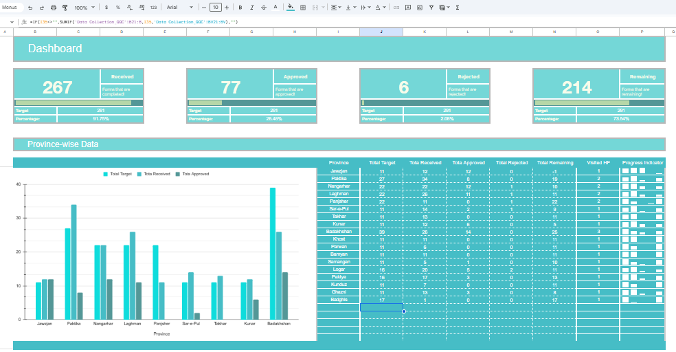
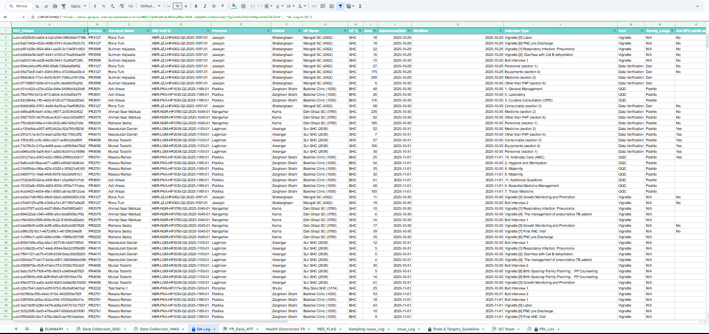
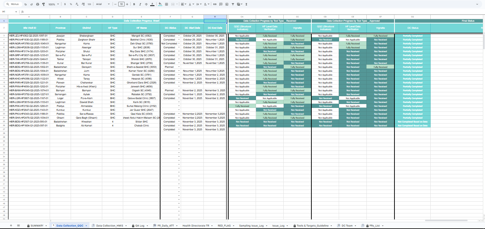

> Created by **Farhad Sahebi — Professional Data Analyst**
> 
> [View my LinkedIn Profile](https://www.linkedin.com/in/farhad-sahebi-ab20b2241)

# HER2 ESS — Data Collection Tracker (Google Sheets)

A professional **Google Sheets–based tracker** designed to manage the full data collection process: **planning → fieldwork → QA → reporting**.  
This project demonstrates strong skills in workflow design, data validation, progress monitoring, and dashboard automation.

🔗 **Live Tracker (Google Sheets)**  
[View the tracker here](https://docs.google.com/spreadsheets/d/1j35Q9OACcu17UXUo52C4lQlUc9avPY5TJQs6eXFDMRM/edit?usp=sharing) *(view-only access, charts and formulas fully functional)*

---

## Purpose
This tracker was developed to help manage large-scale data collection across multiple provinces, ensuring timely progress, accurate QA checks, and clear reporting dashboards.

---
## Screenshots
**Dashboard View**

.png)

**QA Log**

**DC Progress**

**Tools & Targets_Guideline**

## Repository structure
